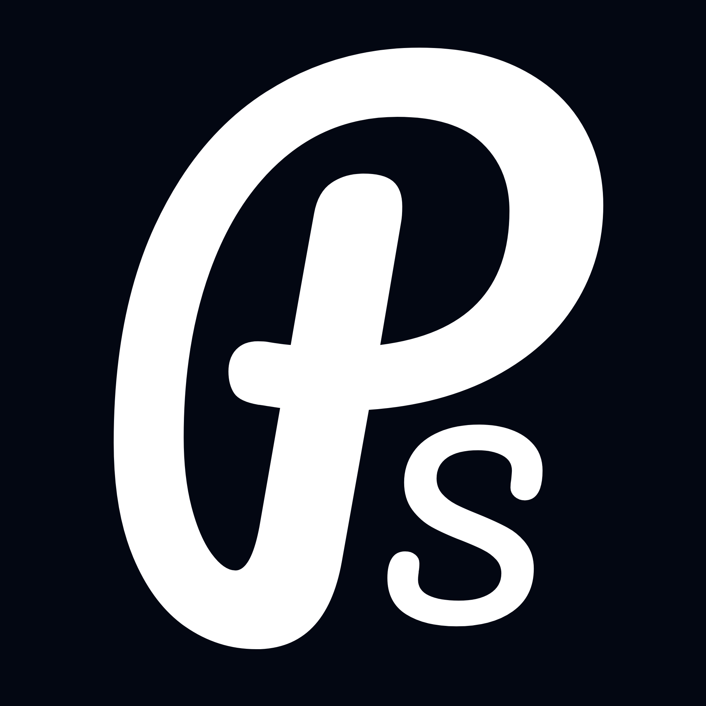

<!-- PROJECT LOGO -->

  

  <h3 align="center">VibePost</h3>

<!-- ABOUT THE PROJECT -->
## About The Project

VibePost is a fun web application that turns your photos into a short story.

### How It Works

1. **Upload Images** — Drag and drop or select photos from your device
2. **Generate Story** — Click the button to process your images
3. **Read Your Story** — The app uses AI to caption each image, then weaves them into a short narrative

The app uses:
- **BLIP** (Salesforce) for image captioning
- **OPT-1.3b** (Meta) for story generation

Both models run locally — no API calls, no costs.
